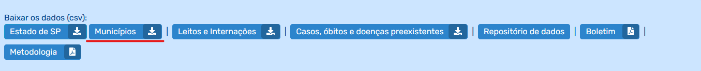

# Relatório COVID: DRS Com Maior Letalidade

O objetivo deste relatório é mostrar, por meio dos dados coletados no [site do SEADE](https://www.seade.gov.br/coronavirus/) qual DRS (Departamento Regional de Saúde) tem a maior taxa de letalidade pelo COVID até o momento, ou seja, qual DRS perdeu mais infectados pelo COVID em relação ao total de infectados.

## Conteúdo

O relatório tem uma seção introdutória para explicar como tudo ele foi feito, os objetivos, de onde vieram os dados e como foram analisados.  

Logo após a seção introdutória, há uma seção mostrando o contexto no qual foi feito o relatório e sobre o que ele estará mostrando exatamente.

Na seção de análise de dados encontra-se o gráfico principal com o resultado da análise e texto explicando esse resultado.

Na seção de conclusão mostra as consequências do resultado, no que aquilo realmente impactou a realidade.

Para ver o relatório em pdf com essas seções [clique aqui](htpps://github.com/Uns0g/relatorio-covid_python/blob/root/relatorio-covid_taxa-de-letalidade_pedro-rossi.pdf)

__(Irei adicionar mais informações aqui quando finalizar o relatório)__

## Pré-requisitos

1. Primeiramente é necessário instalar a versão mais recente do Python pelo [site](https://www.python.org/downloads/), muito provavelmente já instalará o pip, instalador de pacotes para o Python, mas caso você use uma versão antiga pode instalar o pip posteriormente. 
2. Após instalar o pip é necessário utilizá-lo para instalar as bibliotecas Openpyxl, Matplotlib e FPDF. Todas são extremamente simples de serem instaladas e na própria documentação há tutorial para isso. 
3. Infelizmente o script não pega o arquivo .csv direto do site do SEADE, então é altamente recomendado que quem venha a executar o script baixe a versão mais recente do .csv, isso pode ser feito clicando no botão sublinhado da imagem abaixo quando estiver na seção de coronavírus do site do SEADE: 



## Como O Relatório É Gerado

O relatório é gerado através da execução do script ```main.py``` no diretório principal deste repositório, que automaticamente executa o ```repositorio.py``` que é quem realmente cria o relatório em pdf, seja pelo clique duplo no arquivo no diretório onde o arquivo se encontra, seja pela execução em uma IDE. Para ver o código clique acima no arquivo com o nome indicado ou [clique aqui](https://github.com/Uns0g/relatorio-covid_python/blob/root/main.py). 

### Funcionamento E Execução Do Script Principal

---

O script principal primeiramente converte o csv baixado do site do SEADE em xlsx, pois só assim é possível coletar os dados disponibilizados. 

Depois de criada a planilha, o script substitui os valores da coluna B que estão separados por Grande Região para a DRS que o município pertence. É feita antes uma verificação para identificar a qual departamento o município pertence. 

Logo após é criada uma outra planilha no mesmo arquivo, onde, ao invés de ter uma enorme tabela com todos os municípios o script organiza todos eles por DRS com dezessete tabelas, uma para cada departamento.

Após ter feito toda a nova planilha o script simplesmente soma os valores de cada coluna com casos e óbitos para depois calcular as taxas de letalidade e distribuí-las no gráfico de barras apresentado em ```departamentos.png``` - [clique aqui](https://github.com/Uns0g/relatorio-covid_python/blob/root/departamentos.png) para ver o gráfico - não sem antes pegar a taxa de letalidade de todo o Estado de São Paulo.

Por fim a planilha é estilizada para ficar visualmente agradável a quem a visualiza e o script principal executa o ```relatorio.py``` automaticamente e lá o relatório em pdf é gerado. **Mesmo que a execução do script do relatorio seja automática é bom executar depois só o script dele, já que ele não fica muito legível na execução automática**.

## Dicionário

- **DRS:**
    - Acrônimo para **D**epartamento **R**egional de **S**aúde. Os departamentos são divisões administrativas da Secretaria de Estado da Saúde de São Paulo e atualmente existem 17 delas dentro do Estado de São Paulo (para mais informações, clique [neste link](http://www.saude.sp.gov.br/ses/institucional/departamentos-regionais-de-saude/regionais-de-saude)).
- **Taxa De Letalidade:**
    - A porcentagem de pessoas infectadas por uma doença (neste caso a COVID-19) que evoluem para óbito.
- **SEADE:**
    - Fundação Sistema Estadual de Análise de Dados, utilizada pelo Governo Do Estado De São Paulo para análise de dados coletados por sistemas do governo. Para ver o site da fundação [clique aqui](https://www.seade.gov.br).
